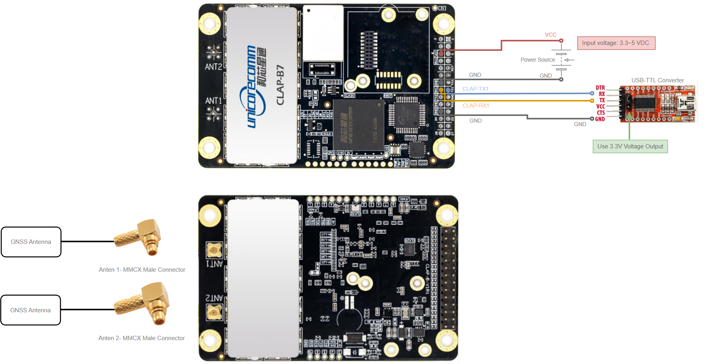

# Clap-B7 Test Drivers and Basic Usage
This repository include Clap B7 ROS1 and ROS2 test drivers.


### Wiring for USB Connection

Clap-B7 Wiring for USB Connection      |
:-------------------------:|



>**Input voltage must be between 3.3V and 5V!**

* `CLAP-TX1 --> USB-TTL RX`
* `CLAP-RX1 --> USB-TTL TX`
* `CLAP-GND --> USB-TTL GND`

* `CLAP-VCC --> VCC (3.3 - 5V DC)`
* `CLAP-GND --> GND`


```
After completing the wiring, you can run the driver by plugging the usb cable into your computer.
```


## NTRIP Settings

For using NTRIP, you have to uncomment `NTRIP Settings lines` and `NTRIP_client_start()` function line in driver.

After this step, you need to enter the relevant places NTRIP settings. These settings are NTRIP ip, NTRIP username, NTRIP password, NTRIP mount point and NTRIP port.

```

```

Parameter | Description |
--- | --- |
param | desc |
